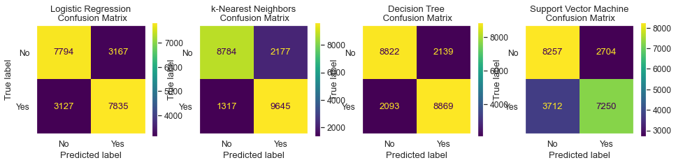

# Comparing Classifiers
**Overview**: In this practical application, your goal is to compare the performance of the classifiers we encountered in this section, namely k-Nearest Neighbor, Logistic Regression, Decision Trees, and Support Vector Machines. We will utilize a dataset related to marketing bank products over the telephone.

The input file in data folder!

The assignment of Jupyter notebook for pricing model of a used car is [bank_marketing.17.Aykan.ipynb](bank_marketing.17.Aykan.ipynb).


# Getting Started
Our dataset comes from the UCI Machine Learning repository [link](https://archive.ics.uci.edu/ml/datasets/bank+marketing). The data is from a Portugese banking institution and is a collection of the results of multiple marketing campaigns. We will make use of the article accompanying the dataset [here](data/bank-additional-names.txt) for more information on the data and features.

# Understanding the Data
To gain a better understanding of the data, please read the information provided in the [article](CRISP-DM-BANK.pdf), and examine the Materials and Methods section of the paper.
 ### How many marketing campaigns does this data represent?
**Answer**:
"17 campaigns that occurred between May 2008 and November 2010, corresponding to a total of 79354 contacts"

# Data Set Information

The data is related with direct marketing campaigns of a Portuguese banking institution. The marketing campaigns were based on phone calls. Often, more than one contact to the same client was required, in order to access if the product (bank term deposit) would be ('yes') or not ('no') subscribed.

There are four datasets in the UCI link:
1) [bank-additional-full.csv](data/bank-additional-full.csv) with all examples (41188) and 20 inputs, ordered by date (from May 2008 to November 2010), very close to the data analyzed in [Moro et al., 2014]
2) bank-additional.csv with 10% of the examples (4119), randomly selected from 1), and 20 inputs.
3) bank-full.csv with all examples and 17 inputs, ordered by date (older version of this dataset with less inputs).
4) bank.csv with 10% of the examples and 17 inputs, randomly selected from 3 (older version of this dataset with less inputs).
The smallest datasets are provided to test more computationally demanding machine learning algorithms (e.g., SVM).

The classification goal is to predict if the client will subscribe (yes/no) a term deposit (variable y).


### Understanding the Features
Examine the data description below, and determine if any of the features are missing values or need to be coerced to a different data type.

```
Input variables:
# bank client data:
1 - age (numeric)
2 - job : type of job (categorical: 'admin.','blue-collar','entrepreneur','housemaid','management','retired','self-employed','services','student','technician','unemployed','unknown')
3 - marital : marital status (categorical: 'divorced','married','single','unknown'; note: 'divorced' means divorced or widowed)
4 - education (categorical: 'basic.4y','basic.6y','basic.9y','high.school','illiterate','professional.course','university.degree','unknown')
5 - default: has credit in default? (categorical: 'no','yes','unknown')
6 - housing: has housing loan? (categorical: 'no','yes','unknown')
7 - loan: has personal loan? (categorical: 'no','yes','unknown')
# related with the last contact of the current campaign:
8 - contact: contact communication type (categorical: 'cellular','telephone')
9 - month: last contact month of year (categorical: 'jan', 'feb', 'mar', ..., 'nov', 'dec')
10 - day_of_week: last contact day of the week (categorical: 'mon','tue','wed','thu','fri')
11 - duration: last contact duration, in seconds (numeric). Important note: this attribute highly affects the output target (e.g., if duration=0 then y='no'). Yet, the duration is not known before a call is performed. Also, after the end of the call y is obviously known. Thus, this input should only be included for benchmark purposes and should be discarded if the intention is to have a realistic predictive model.
# other attributes:
12 - campaign: number of contacts performed during this campaign and for this client (numeric, includes last contact)
13 - pdays: number of days that passed by after the client was last contacted from a previous campaign (numeric; 999 means client was not previously contacted)
14 - previous: number of contacts performed before this campaign and for this client (numeric)
15 - poutcome: outcome of the previous marketing campaign (categorical: 'failure','nonexistent','success')
# social and economic context attributes
16 - emp.var.rate: employment variation rate - quarterly indicator (numeric)
17 - cons.price.idx: consumer price index - monthly indicator (numeric)
18 - cons.conf.idx: consumer confidence index - monthly indicator (numeric)
19 - euribor3m: euribor 3 month rate - daily indicator (numeric)
20 - nr.employed: number of employees - quarterly indicator (numeric)

Output variable (desired target):
21 - y - has the client subscribed a term deposit? (binary: 'yes','no')
```

### Data Cleaning and Transformation
There are categorical variables in the dataset, I will transform them before further analyze them.
#### Analyze Features
Some features have _unknown_ values, this may impact the models, by checking the feature importance chart, one approach is to assign null to less important features, remove those null tuples from the dataset later on. Especially, `day_of_week`, `loan` and `housing` are at the bottom, I will remove them so no null assignment for them.

| Feature | Importance |
| ------- | ---------- |
|	emp.var.rate|	0.093042|
|	poutcome|	0.047772|
|	cons.conf.idx|	0.026913|
|	contact|	0.005341|
|	default|	0.001988|
|	job|	0.001256|
|	age|	0.000928|
|	month|	0.000579|
|	campaign|	0.000469|
|	marital|	0.000361|
|	housing|	0.000024|
|	loan|	0.000004|
|	day_of_week|	-0.000019|
|	education|	-0.000128|

Although, it is shown in the list `education` seems to have some influence especially in illiterate people's case. So, I will keep it in the list, I can consider dealing with `unknown` values in later phases.

#### Columns Transformations
Although, this can be done with encoders, I went with direct transformation since I worked on them to analyze each feature, also, I used them in correlation matrix after the transformation:
 + `job` is categorical, I used factorize to transform it to numeric
 + `marital` is categorical, I used factorize to transform it to numeric
 + `education` is categorical, I used mapping to transform it to numeric:
 `{'basic.4y':2,'basic.6y':3,'basic.9y':4,'high.school':5,'illiterate':1,'professional.course':6,'university.degree':7,'unknown':0}`
 + features `default`, `housing` and `loan` have yes/no/unknown values, mapped as:
 `{'no':1,'yes':2,'unknown':0}`
 + `education` is categorical, I used mapping to transform it to numeric:
 `{'mon':1,'tue':2,'wed':3,'thu':4,'fri':5}`
 + `poutcome` is categorical, I used mapping to transform it to numeric:
 `{'failure':1,'nonexistent':0,'success':2}`

Finally, I transformed the target variable `y`, `yes/no` values to `1/0`  

#### Feature Overlapping
The subset of data is considered for a baseline model which has only 7 bank-client features: 'age', 'job', 'marital', 'education', 'default', 'housing' and 'loan'. This yields 2085 unique groups of feature overlapping failing to identify `yes/no` classes in `y` distinctly. This is effecting 19528 rows in the entire population which is **47%** of dataset.
 
The full dataset has 237 unique groups of feature overlapping failing to identify `yes/no` classes in `y` distinctly. This is effecting 3665 rows in the entire population which is **9%** of dataset, this is impacting the ability of models to predict outcome for such corner cases.

These observations should be kept in the baseline calculation.

### Features
Senior people after age 60 accept campaigns more, so do illiterate people, in contrast to that all professions seem to preserve the same ratio!


# Business Objective
Due to domestic competition and current financial crisis, there is a huge pressure on European banks to increase financial asset. To overcome this issue, one strategy would be to offer attractive long-term deposit applications with good interest rates, particularly by using directed marketing campaigns. Also, the same economic factors apply for cost reduction and time.
 
 Thus, there is a need for **improvement in efficiency**: `lesser customer contacts must be done, but on the otherhand same success rate must be retained`, namely **rate** of _clients subscribing to the deposit_ `must be retained`.

# A Baseline Model
Before we build our first model, we want to establish a baseline. What would be the baseline performance that our classifier should aim to beat?

The distribution of target variable shows `89%` of observations is `No`, only `11`% is `Yes` shown in below plot: 
 

The baseline is **89%** by the target variables outlined in the count plot, the model should be better than this baseline! However, the [feature overlapping](#feature-overlapping) rate above indicates only 53% can be properly classified, 47% being arbitrarily due to feature overlapping. If we assume 50-50, best we can get is **`77%`** for this dataset as `baseline` versus simply rely on 89% by the target observations.

After running all 4 models with default hyperparameters, the outcome on recall metric is not very promising, the outcome of Logistic Regression, k-Nearest Neighbors, Decision Tree and Support Vector Machines all performed poorly, there is no outstanding result:

|	Model	|Train Time|	Train Accuracy|	Test Accuracy|
|-----------|----------|------------------|--------------|
|	Logistic Regression	|0.013428|	0.000000|	0.000000|
|	KNN|	0.012411	|0.126886|	0.063937|
|	Decision Tree	|0.031382|	0.308901|	0.099856|
|	SVM|	19.583614|	0.016939|	0.009339|

The score of Logistic Regression came out as 0.0 and fastest, SVM being the slowest of all.

# Improving the Model

## Dataset Allocation
Since all features transformed to numeric representation, a correlation matrix can be checked since there are not many features in the dataset:
 

Per correlation matrix above, there are some strong correlation among these independendent variables which is indicating `multicollinearity` in the dataset:
 - `poutcome` strongly correlated with `pdays` (negative) and `previous` (positive)
 - `emp.var.rate` strongly positive correlated with `cons.price.idx`, `euribor3m` and `nr.employed`
I can safely remove those features which are highly correlated above 75%. Later, I would run a multicollinearity analysis on the dataset to verify those findings.

Also, 9% of full dataset cannot be correctly classified as the remaining features on it cannot distinctly define boundaries in the final outcome. Again, if we assume 50-50 distribution, the best outcome will be 95% but realiably accurate outcome is 91% on the full dataset. 

Please also note that, `duration` feature is only known after a call to customer is completed which is an after-the-fact feature, is not available upfront for executing a model. Therefore, it is should be stripped off the dataset.

So these are the features must be removed before proceeding any further with enhanced analysis and model executions:
`'duration', 'pdays', 'previous', 'cons.price.idx', 'euribor3m', 'nr.employed'`

### Multicollinearity Analysis
I ran multicollinearity analysis on the remaining dataset, there is nothing above 5 in the list pointing multicollinearity by running Variance Inflation Factor (VIF):

|Feature|	VIF|
|-------|------|
|emp.var.rate|	1.583261|
|contact	|1.563009|
|month	|1.380385|
|poutcome|	1.280853|
|cons.conf.idx|	1.271658|
|default|	1.128615|
|education|	1.104042|
|age	|1.092416|
|housing|	1.063655|
|loan	|1.055819|
|marital|	1.028582|
|campaign|	1.027430|
|job	|1.014802|
|day_of_week|	1.001330|

### Feature Importance
Also, one more check to complete is feature importance, I ran that too:

|Feature|	Importance|
|-------|------|
|	emp.var.rate|	0.093042|
|	poutcome	|0.047772|
|	cons.conf.idx|	0.026913|
|	contact	|0.005341|
|	default	|0.001988|
|	job	|0.001256|
|	age	|0.000928|
|	month	|0.000579|
|	campaign|	0.000469|
|	marital	|0.000361|
|	housing	|0.000024|
|	loan	|0.000004|
|	day_of_week|	-0.000019|
|	education|	-0.000128|

Also, I ran L1 Regularization to see what features picked:

Features `loan`, `housing`, `day_of_week` and `month` seem less important in this plot. `loan` and `day_of_week` features are also bottom 2 in the `permutation importance` list. Also, note `education` feature is second most important, so, I will not remove that feature.

Further, After the feature engineering methods revealed bottom features, I removed `loan`, `housing`, and `day_of_week` columns and split dataset again. Beyond that, the multicollienarity check by Variance Inflation Factor (VIF) did not point out any features. Going with the scaled dataset after removing 3 less important features from the X dataset, namely: `'loan', 'housing', 'day_of_week'`

### SMOTE method
The dataset is severely imbalanced having 11% acceptance rate and 89% not accepting. Applying SMOTE to have equal number of data entries on either classes of target observation `Yes/No`.

### Standardization
Standardization is applied to the dataset in order to avoid small features penalized heavily by the penalty term since features are skewed.

# Model Building
All 4 models Logistic Regression, k-Nearest Neighbors, Decision Tree and Support Vector Machines were built and fed into GridSearchCV by using roc_auc in scoring hyperparameter since it is binary classification per manual:
“A receiver operating characteristic (ROC), or simply ROC curve, is a graphical plot which illustrates the performance of a binary classifier system as its discrimination threshold is varied. It is created by plotting the fraction of true positives out of the positives (TPR = true positive rate) vs. the fraction of false positives out of the negatives (FPR = false positive rate), at various threshold settings. TPR is also known as sensitivity, and FPR is one minus the specificity or true negative rate.”

Each model fed with hyperparameter list to evaluate best outcome, they are captured in a table.

## Model Results
**k-Nearest Neighbors** with _91%_ is pretty close to our performance metric projection due to `feature overlapping`. **Decision Tree** is pretty good too, their train time is pretty close 31 seconds each and reasonable with the magnitude of data. However, Logistic Regression is one click better than Support Vector Machine and fastest train time. SVM took over an hour to train with no parallelism and performed worst in both test accuracy and train time.

|Model|	Train Time|	Train Accuracy|	Test Accuracy| Hyperparameters |
|-----|-----------|---------------|--------------|-----------------|
|	Logistic Regression|	0.033166|	0.759782|	0.763205|`{'C': 100, 'max_iter': 1000, 'solver': 'lbfgs'}`|
|	k-Nearest Neighbors|	0.030518|	0.995653|	0.908220|`{'n_neighbors': 13, 'p': 1, 'weights': 'distance'}`|
|	Decision Tree|	0.071775|	0.929373|	0.891593|`{'criterion': 'entropy', 'max_depth': 33, 'min_samples_leaf': 2, 'min_samples_split': 0.001}`|
|	Support Vector Machine|	55.611333|	0.746876|	0.750658|`{'C': 0.001, 'cache_size': 1000, 'gamma': 0.01, 'kernel': 'rbf'}`|


The logistic regression came out with a weaker `C` hyperparameter for regularization and chose `lbfgs` as solver and being fastest. KNN chose 13 neighbors and best estimator, followed by Decision Tree went with entropy more computationally heavy than gini but train time still less than KNN due to less hyperparameter combinations. Finally, Support Vector Machine came out as the worst performer in both time and score although it picked slightly smaller `gamma` which is higher dimension also higher bias and smaller variance by `C`.

As shown in the confusion matrix, KNN has fewer misclassifications, and better area under the curve (AUC) below:


As shown in Receiver Operating Characteristics curve, the performance of KNN and Decision Tree similar and similarly Logistic Regression and Support Vector Machines.

# Next Steps
What are next steps?
1. I briefly highlighted "`unknown`" values in categorical variables, `job` and `marital` features are highly influential, those unknown values should be removed from the dataset to try out again in those models
2. Secondly, [overlapping features](#feature-overlapping) should be addressed in the dataset which brings ambiquity to those models, once they are cleared, models should be reevaluated for better performance
3. SVM could be tried with poly kernel and higher degrees, however, it is very CPU-intensive should be on a dedicated computer
4. Logistic Regression with various `solver` and `C` hyperparameter values

# Conclusion
**k-Nearest Neighbors** came at _91%_ outperformed all other models which is inline with my performance metric projection due to the [overlapping features](#feature-overlapping). Second best is **Decision Tree**, its train time is also the second best was 31 seconds. Logistic Regression and Support Vector Machine models are the worst performers. Especially, SVM with no parallelism took over an hour to train the model, it is very costly but yielding not far better results.

**KNN** is best performing, easy to train and second less costly after Logistic Regression.